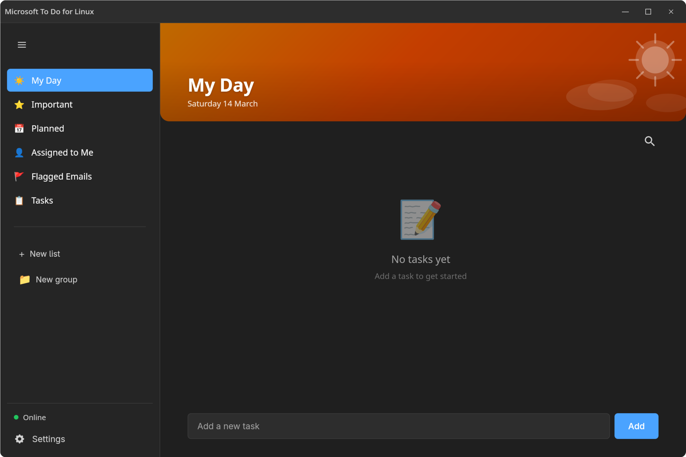

<p align="center">
  
</p>

<h1 align="center">Microsoft To Do for Linux</h1>

<p align="center">
  <em>A fast, native Linux desktop client for Microsoft To Do.</em><br/>
  Built with <a href="https://tauri.app/">Tauri v2</a>, React, and TypeScript. Syncs with your Microsoft account via the Graph API.
</p>

<p align="center">
  <a href="https://github.com/alexjfinch/mstodo-for-linux/releases/latest"></a>
  <a href="https://github.com/alexjfinch/mstodo-for-linux/releases"></a>
  <a href="https://github.com/alexjfinch/mstodo-for-linux/actions"></a>
  <a href="https://github.com/alexjfinch/mstodo-for-linux/stargazers"></a>
  <a href="https://github.com/alexjfinch/mstodo-for-linux/blob/main/LICENSE"></a>
</p>

<br/>

<p align="center">
  <picture>
    <source media="(prefers-color-scheme: dark)" srcset="docs/screenshot-dark.png" />
    <source media="(prefers-color-scheme: light)" srcset="docs/screenshot-light.png" />
    
  </picture>
</p>

<br/>

## Why?

Microsoft doesn't offer a native To Do app for Linux and when I was looking at learning something new to do I thought about creating an electron wrapper for the webapp - I then found through research that most Linux users hate this approach due to the overhead of electron. This project fills that gap with a lightweight desktop app that authenticates with your Microsoft account and syncs tasks, lists, attachments, and more - all through the official Graph API.

> **Note:** I am not a trained app developer, this started as a personal project to learn coding with the help of AI. Feel free to submit PRs to improve things. If you find anything rough around the edges, I apologise but I hope it's useful to you!

---

## Installation

### Download

Grab the latest package from the [Releases](https://github.com/alexjfinch/mstodo-for-linux/releases/latest) page:

| Format | Distros | Install |
|--------|---------|---------|
| `.deb` | Debian, Ubuntu, Pop!_OS, Mint | `sudo dpkg -i mstodo-for-linux-*.deb` |
| `.rpm` | Fedora, RHEL, openSUSE | `sudo dnf install mstodo-for-linux-*.rpm` |
| `.AppImage` | Any | `chmod +x *.AppImage && ./mstodo-for-linux-*.AppImage` |

### Flatpak

*Coming soon*

---

## Getting Started

1. Launch the app
2. Click **Sign In** - your browser opens to the Microsoft login page
3. Sign in and grant the app permission to access your tasks
4. Your tasks sync automatically

No configuration needed. The app uses a pre-registered public client with the Microsoft identity platform, so you just sign in and go.

---

## Features

### Core

| | Feature | Description |
|---|---|---|
| :arrows_counterclockwise: | **Microsoft account sync** | Tasks, lists, attachments, and checklist items sync via Microsoft Graph API |
| :floppy_disk: | **Offline-capable** | Local SQLite database lets you work offline; changes sync when you reconnect |
| :busts_in_silhouette: | **Multiple accounts** | Sign in and switch between multiple Microsoft accounts |
| :bell: | **Reminders & notifications** | Set reminders (later today, tomorrow, next week) with desktop notifications |

### Views & Organisation

| | Feature | Description |
|---|---|---|
| :sunny: | **My Day** | Daily focus view with a smart suggestion engine for task recommendations |
| :star: | **Important** | Quick access to starred tasks |
| :calendar: | **Planned** | Tasks grouped by due date and reminders |
| :file_folder: | **List groups** | Organise lists into collapsible groups with drag-and-drop |
| :label: | **List renaming** | Double-click a list name to rename it inline |
| :art: | **List theming** | Customise lists with accent colours and emoji icons |
| :1234: | **Task counts** | Badge showing number of tasks next to each list in the sidebar |
| :mag: | **Search** | Search across all lists by title |
| :bar_chart: | **Sort** | Sort by due date, importance, alphabetical, or creation date |

### Task Management

| | Feature | Description |
|---|---|---|
| :pencil2: | **Detail panel** | Edit title, notes, due date, importance, recurrence, categories, steps, and attachments |
| :repeat: | **Recurrence editor** | Full recurrence UI with interval, day-of-week picker, and end date controls |
| :white_check_mark: | **Subtasks / steps** | Add, check off, and delete checklist items synced with Microsoft To Do |
| :paperclip: | **File attachments** | Attach files (up to 3 MB) and download them using the OS file picker |
| :date: | **Custom calendar picker** | Inline calendar for setting due dates from the task list or detail panel |
| :point_up_2: | **Drag-and-drop** | Reorder tasks within a list, drag tasks between lists, and drag suggestions into My Day |
| :clipboard: | **Multi-select** | Shift-click to select multiple tasks for bulk actions |
| :hash: | **Hashtag categories** | Type `#tag` in quick add or task title to auto-assign categories |
| :warning: | **Overdue highlighting** | Overdue tasks are visually highlighted with a red accent |

### Appearance & UI

| | Feature | Description |
|---|---|---|
| :art: | **Themes** | Light, dark, and system themes (reads desktop environment preference) |
| :straight_ruler: | **Compact mode** | Reduce row spacing for denser task views |
| :abc: | **Font sizes** | Small, normal, and large text sizes |
| :desktop_computer: | **Custom title bar** | Native window controls without OS decorations |
| :arrow_down_small: | **System tray** | Minimise to tray with a badge showing overdue/due-today count |
| :zap: | **Auto-sync** | Configurable sync interval (30s, 1m, 5m, or manual) |
| :rocket: | **Global quick-add** | System-wide shortcut to add a task from anywhere with natural language date parsing |

---

## Limitations

Unfortunately the group functionality of Microsoft ToDo isn't exposed via the official Graph API and therefore any groups created on the webapp are not synced and vice versa, no groups created locally are synced to the webapp.

---

## Roadmap

Planned features, roughly in priority order:

- [ ] **Keyboard shortcuts** - Ctrl+N for new task, Ctrl+D to toggle complete, Delete to remove
- [ ] **Thunderbird integration** - add emails as tasks from other email accounts
- [ ] **Flatpak packaging** - for easier cross-distro installation

---

## Building from Source

### Prerequisites

- [Node.js](https://nodejs.org/) (v18+)
- [Rust](https://rustup.rs/) (stable)
- Tauri v2 system dependencies (see [Tauri prerequisites](https://v2.tauri.app/start/prerequisites/))

### Development

```bash
npm install
npm run tauri dev
```

### Build

```bash
npm run tauri build
```

The built packages (`.deb`, `.rpm`, `.AppImage`) will be in `src-tauri/target/release/bundle/`.

---

## Tech Stack

| Layer | Technology |
|-------|-----------|
| Desktop framework | Tauri v2 (Rust) |
| Frontend | React 18 + TypeScript |
| Build tool | Vite |
| Local storage | SQLite via `@tauri-apps/plugin-sql` |
| Settings | `@tauri-apps/plugin-store` |
| Auth | OAuth 2.0 PKCE (Microsoft identity platform) |
| API | Microsoft Graph API v1.0 |

---

## Security & Privacy

Authentication uses **OAuth 2.0 with PKCE** (Proof Key for Code Exchange) - a flow designed for native public clients. Your Microsoft credentials are never seen or stored by this app. Tokens are stored in your system keyring (e.g. GNOME Keyring, KWallet).

**No telemetry. No analytics. No backend server.** Data only leaves your machine via requests to the Microsoft Graph API on your behalf.

<details>
<summary>Azure AD permissions</summary>

This app uses a publicly registered Azure AD client (ID: `2a0ee15b-0a96-44d2-b30d-3cf604947669`). This is not a secret - it identifies the app to Microsoft during sign-in.

| Scope | Reason |
|---|---|
| `Tasks.Read` / `Tasks.ReadWrite` | Read and manage your To Do tasks and lists |
| `User.Read` | Fetch your display name and email address |
| `offline_access` | Refresh your session without requiring re-authentication |

You can review and revoke access at any time from your [Microsoft account permissions page](https://account.live.com/consent/Manage).

</details>

---

## Contributing

Contributions are welcome! Feel free to open issues or submit pull requests.

---

<p align="center">
  <sub>This project is not affiliated with or endorsed by Microsoft. "Microsoft To Do" is a trademark of Microsoft Corporation.</sub>
</p>
